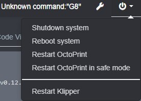

# Voron Maintenance Commands

This document provides a list of commonly used commands for maintaining and troubleshooting Voron 3D printers.

## General Commands

- **FIRMWARE_RESTART**  
  Use this command if any updates are made to the printer configuration file.  
  1. Save the configuration file.  
  2. Restart Klipper by typing:  
  `FIRMWARE_RESTART`

- **Restart Klipper**  
  If you need to restart Klipper, click on:  
  `restart Klipper`
   

     

  

- **Check Printer Status**  
  Check the current status of the printer with:  
  `status`

## Movement Commands

- **Home All Axes**  
  Home the printer's axes using the following command:  
  `G28`

- **Move Z-Axis**  
  Move the Z-axis to a specific height:  
  `G0 Z10`

- **Move All Axes**  
  Move the X, Y, and Z axes to specific positions:  
  `G0 X175 Y175 Z20`

- **Set Movement Speed**  
  Set the movement speed with the following command:  
  `F 5000`

## Additional Commands

- **Turn On Case Lights**  
  Turn the case lights on by typing:  
  `caselights_on`

- **Bed Leveling**  
  Level the bed using this command:  
  `QUAD_GANTRY_LEVEL`
