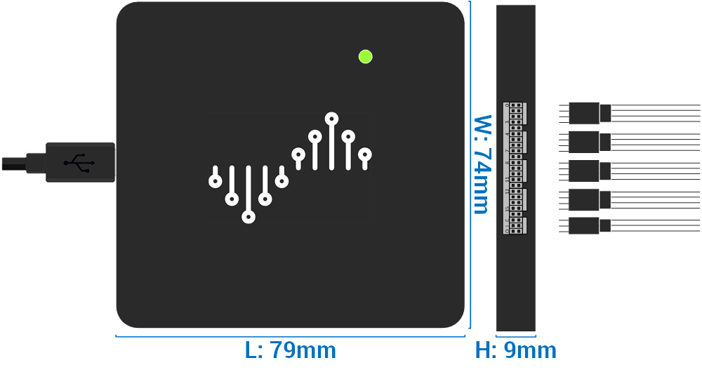

### DSLogic U3Pro16 Logic Analyzer
#### Bin D-01

#### [Overview](https://www.dreamsourcelab.com/shop/logic-analyzer/dslogic-u3pro16/)
#### [Datasheet](https://www.dreamsourcelab.com/doc/DSLogic_U3Pro16_Datasheet.pdf)
#### [User Guide (Software)](https://www.dreamsourcelab.com/doc/DSView_User_Guide.pdf)
#### [Software Download](https://www.dreamsourcelab.com/download/)

#### Notes:
##### A. Potential issue with 64-bit software in Windows 11, 32-bit seems to work as expected

