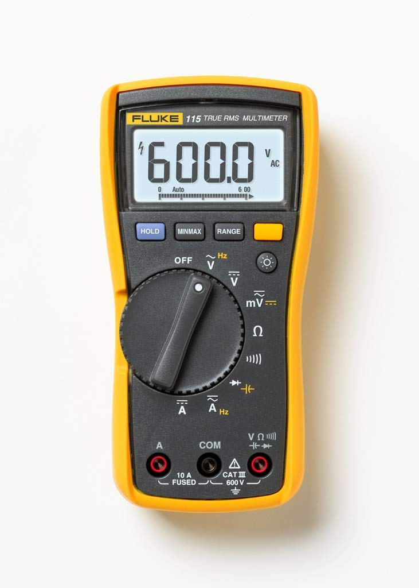

### Fluke 115 True-RMS Digital Multimeter (Handheld)
#### Cabinet A-17
#### [Overview](https://www.fluke.com/en-us/product/electrical-testing/digital-multimeters/fluke-115#)
#### [Datasheet](https://dam-assets.fluke.com/s3fs-public/flk-2793260b-en-117-extended-specs-ds-w.pdf?iK8zKhZCoPI2YuKIQ1lk.0RIAeEbd76T)
#### [User Guide](https://dam-assets.fluke.com/s3fs-public/110__117umeng0000_0.pdf?kuO8Q80mS6nSqKkZOd2JFMEnAStiGspq)
#### [EEVBlog Features Video](https://www.youtube.com/watch?v=o9QPx5EUWCc)

