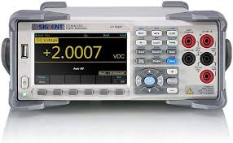

### SDM3045X Digital Multimeter (tabletop)
#### Bin A-07

#### [Overview](https://siglentna.com/digital-multimeters/sdm3045x-digital-multimeter/)
#### [Datasheet](https://siglentna.com/wp-content/uploads/dlm_uploads/2023/02/SDM3045X_DataSheet_E04A.pdf)
#### [User Guide](https://siglentna.com/wp-content/uploads/dlm_uploads/2017/10/SDM3045x_UserManual_UM06034-E01A.pdf)
#### [Tutorial](https://www.youtube.com/watch?v=kLfcEqmhwCE)

