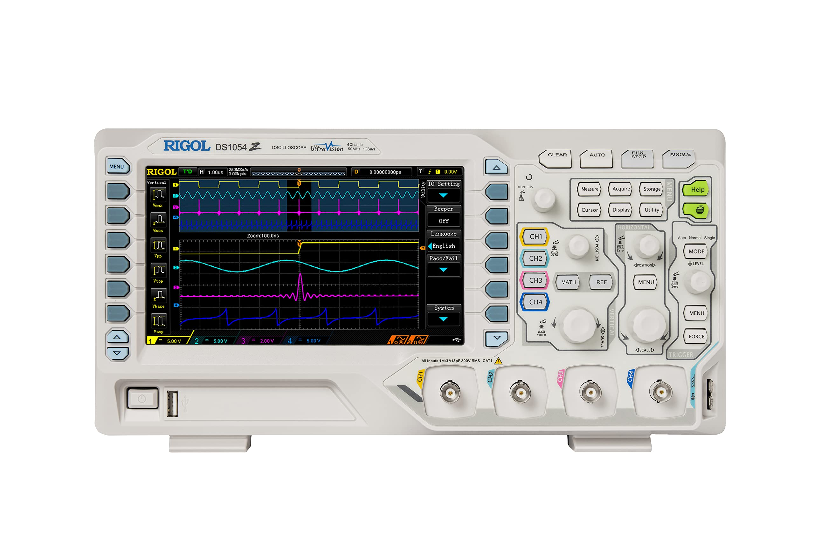

### Rigol DS1054Z Oscilloscope
#### Bin D-03

#### [Overview](https://www.rigolna.com/products/digital-oscilloscopes/1000z/)
#### [Datasheet](https://beyondmeasure.rigoltech.com/acton/attachment/1579/f-0504/1/-/-/-/-/MSO1000Z_Datasheet.pdf)
#### [User Guide](https://beyondmeasure.rigoltech.com/acton/attachment/1579/f-050a/1/-/-/-/-/MSO1000Z%26DS1000Z_UserGuide.pdf)
#### [EEVBlog Features Video](https://youtu.be/W2qdtQkBKhc?si=Ou0ODaTi1eGmMzsI)

#### Notes:
##### A. Currently only have 3 probes for a 4 channel scope
##### B. The green help button is a good source of 'getting started' information

